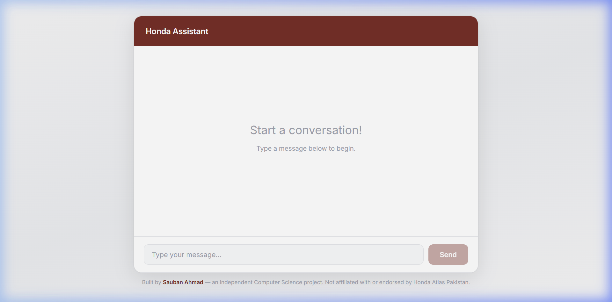
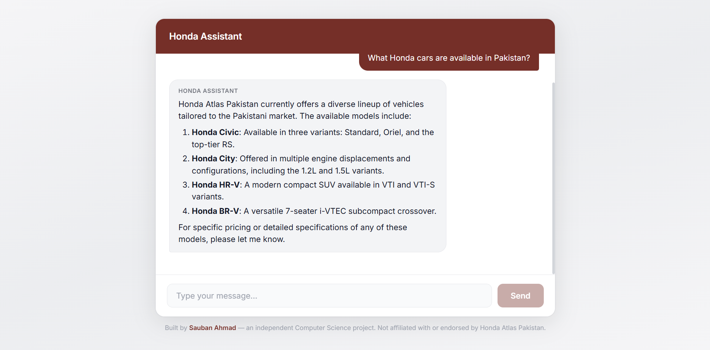

<p align="center">
  
</p>

<h1 align="center">Honda AI Assistant (Hobot)</h1>

<p align="center">
  An AI-powered customer service chatbot built as a demonstration for Honda Atlas Pakistan.
  <br />
  <strong>Real-time streaming · RAG-powered · Prompt-engineered guardrails</strong>
</p>

<p align="center">
  
  
  
  
  
  
  
</p>

---

> **Disclaimer:** This is an independent Computer Science project by [Sauban Ahmad](http://linkedin.com/in/sauban05). It is **not** affiliated with, endorsed by, or connected to Honda Atlas Pakistan in any way.

---

## Screenshots

<p align="center">
  
  <br />
  <em>Clean interface with Honda branding</em>
</p>

<p align="center">
  
  <br />
  <em>Real-time streamed AI response grounded in Honda knowledge base</em>
</p>

---

## Architecture

The chat handler (`api/chat.js`) is a single module shared between both environments:

```
                    DEVELOPMENT                          PRODUCTION

              React / Vite (5173)                   React on Vercel
                     │                                     │
                     │  POST /api/chat                     │  POST /api/chat
                     ▼                                     ▼
                Vite Proxy                          Vercel Serverless
                     │                              Function (auto)
                     ▼                                     │
              Express :3001                                │
                     │                                     │
                     ▼                                     ▼
               api/chat.js ◄──────── shared ────────► api/chat.js
                     │                                     │
                ┌────┴────┐                           ┌────┴────┐
                │         │                           │         │
           Gemini    Pinecone                    Gemini    Pinecone
```

### Request Flow

1. Receive user message
2. Generate embedding → Google Gemini Embedding API (`gemini-embedding-2`)
3. Query vector DB → Pinecone (top 10 semantic matches)
4. Build system prompt with retrieved context
5. Stream LLM response → Gemini 3 Flash Preview
6. Pipe stream to client via Vercel AI SDK

---

## Features

| Feature | Description |
|---|---|
| **Real-Time Streaming** | Responses stream token-by-token using Vercel AI SDK's `useChat` hook and `pipeUIMessageStreamToResponse` |
| **RAG Architecture** | Retrieval-Augmented Generation via Pinecone — answers are grounded in real Honda FAQ data |
| **Prompt Guardrails** | The bot strictly discusses only Honda/automotive topics, politely refusing off-topic requests |
| **Markdown Rendering** | AI responses support rich formatting: tables, bold, lists, and more via `react-markdown` |
| **Loading Indicator** | Animated typing dots while the AI is generating a response |
| **Error Handling** | User-friendly error messages with retry button; server-side try/catch with proper HTTP responses |
| **Mobile Responsive** | Adaptive layout with a circular send icon button on small screens |
| **Corporate Theme** | Clean, professional Honda-branded UI with custom color system |
| **Vercel Deployment** | Production-ready serverless deployment — same handler runs locally and on Vercel |

---

## Tech Stack

| Layer | Technology | Purpose |
|---|---|---|
| **Frontend** | React 19 + Vite 8 | UI framework and build tool |
| **Styling** | Vanilla CSS | Custom design system — no CSS frameworks |
| **Backend (Local)** | Node.js + Express 5 | Local dev server wrapping the shared handler |
| **Backend (Production)** | Vercel Serverless Functions | Auto-deployed from `api/` directory |
| **AI SDK** | Vercel AI SDK v7 (`ai`, `@ai-sdk/react`, `@ai-sdk/google`) | Streaming, chat hooks, embeddings |
| **LLM** | Google Gemini (`gemini-3-flash-preview`) | Language model for generating responses |
| **Embeddings** | Google Gemini (`gemini-embedding-2`) | Text embeddings for semantic search |
| **Vector DB** | Pinecone | Stores and queries Honda FAQ embeddings |
| **Markdown** | react-markdown + remark-gfm | Renders AI responses with tables, lists, etc. |

---

## Project Structure

```
honda-Chatbot/
├── api/
│   └── chat.js              # Chat handler (shared: Express + Vercel)
├── public/
│   └── favicon.svg          # Honda logo favicon
├── src/
│   ├── assets/
│   │   └── honda.svg        # Honda logo asset
│   ├── components/
│   │   ├── ChatWindow.jsx   # Main chat container (useChat hook)
│   │   ├── MessageBubble.jsx # Individual message rendering
│   │   ├── MessageBubble.css # Bubble, table, typing, error styles
│   │   ├── MessageInput.jsx  # Input bar with send button
│   │   └── MessageList.jsx   # Message list with loading/error states
│   ├── App.jsx              # Root component with disclaimer
│   ├── App.css              # Layout, input bar, mobile responsive styles
│   ├── index.css            # Global design tokens and resets
│   └── main.jsx             # React entry point
├── server.js                # Local Express wrapper (imports api/chat.js)
├── seed.js                  # Script to embed FAQs into Pinecone
├── faq.json                 # Honda FAQ knowledge base data
├── .env.example             # Environment variable template
├── vite.config.js           # Vite config with API proxy
└── package.json
```

---

## Getting Started

### Prerequisites

- **Node.js** v18+ installed
- A **Google Gemini API key** — [Get one here](https://aistudio.google.com/apikey)
- A **Pinecone API key** — [Get one here](https://app.pinecone.io)
- A Pinecone index named `hobot-knowledge` (dimension: 3072, metric: cosine)

### 1. Clone the Repository

```bash
git clone https://github.com/saubanahmad/honda-Chatbot.git
cd honda-Chatbot
```

### 2. Install Dependencies

```bash
npm install
```

### 3. Set Up Environment Variables

Copy the example file and fill in your keys:

```bash
cp .env.example .env
```

```env
GOOGLE_GENERATIVE_AI_API_KEY=your_gemini_api_key_here
PINECONE_API_KEY=your_pinecone_api_key_here
```

### 4. Seed the Knowledge Base (First Time Only)

This embeds the Honda FAQ data into your Pinecone index:

```bash
node seed.js
```

### 5. Run the Application

You need **two terminals** running simultaneously:

**Terminal 1 — Backend Server:**
```bash
npm run server
# Server running http://localhost:3001
```

**Terminal 2 — Frontend Dev Server:**
```bash
npm run dev
# Local: http://localhost:5173
```

Open **http://localhost:5173** in your browser.

---

## Deployment (Vercel)

This project is configured for zero-config deployment on Vercel.

1. Connect your GitHub repository to [Vercel](https://vercel.com)
2. Add environment variables in Vercel dashboard:
   - `GOOGLE_GENERATIVE_AI_API_KEY`
   - `PINECONE_API_KEY`
3. Deploy — Vercel automatically picks up `api/chat.js` as a serverless function

The frontend calls `/api/chat` using a relative path, so it works on both `localhost` (via Vite proxy) and production (via Vercel routing) without any configuration changes.

---

## Environment Variables

| Variable | Description |
|---|---|
| `GOOGLE_GENERATIVE_AI_API_KEY` | Google Gemini API key for LLM and embeddings |
| `PINECONE_API_KEY` | Pinecone API key for vector database |

---

## License

This project is for educational and demonstration purposes only.

---

<p align="center">
  Built by <a href="http://linkedin.com/in/sauban05"><strong>Sauban Ahmad</strong></a>
</p>
